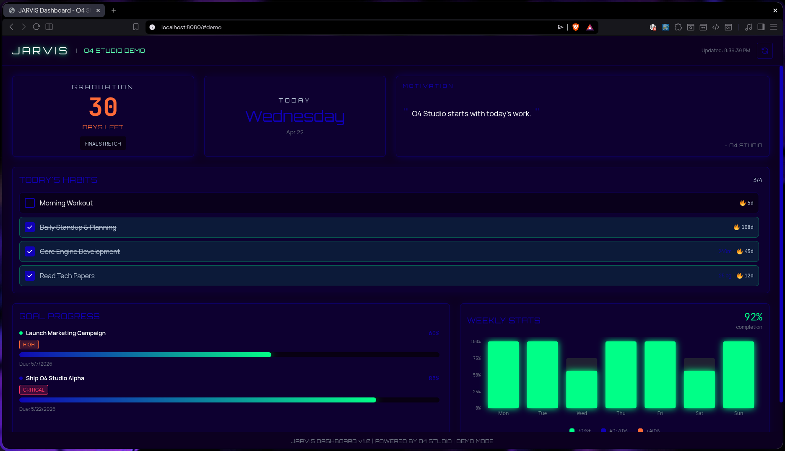
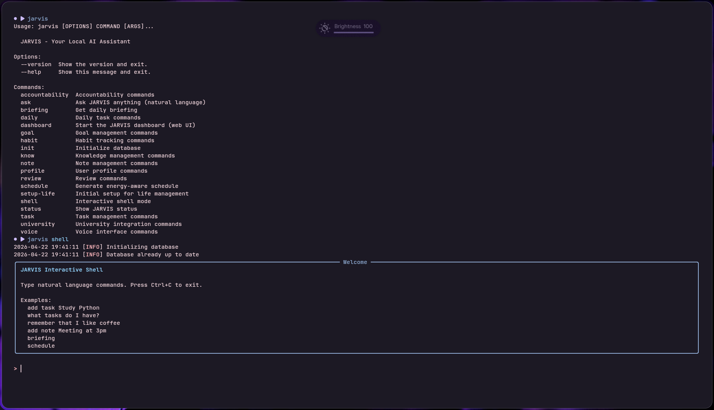

# JARVIS: Personal Life Management Assistant

> **A fully local, privacy-first digital assistant and life management engine.**

Welcome to the core repository for JARVIS. I built this project to act as the central brain for my day-to-day life. Instead of relying on fragmented, cloud-based productivity apps that lock away my data, I wanted a unified system that handles everything: tracking goals, maintaining habit accountability, scraping university assignments, and providing a real-time voice interface.

The ultimate guarantee? **Zero bytes of my personal data ever leave my local machine.**

  

  

---

## The Core Idea

At its heart, JARVIS is an intent-driven ecosystem. It bridges natural language processing (voice and text) with a highly modular "Skill" architecture.

If I tell JARVIS I completed a 4-hour game engine development session, it parses the intent, updates my local SQLite database, recalculates my streaks, and instantly reflects that progress on a high-octane React dashboard. It's not just a to-do list; it's an active accountability partner designed to keep me focused on what actually matters.

---

## Architecture Breakdown

The system is heavily decoupled, ensuring that the voice pipeline, the backend brain, and the web dashboard can operate independently or in tandem.

### 1. The Core Brain (`jarvis.core`)

* **Intent Parser:** A two-phase NLP pipeline using exact regex pattern matching combined with fuzzy keyword similarity to translate human input into actionable commands.
* **Decision Engine:** Routes parsed intents to the appropriate registered Skill Handlers.
* **Service Registry:** The backbone of the application. A centralized dependency injection container that lazy-loads services (Habits, Goals, Profile) so they are instantiated once and shared across the application context.

### 2. The Data Layer (`jarvis.db`)

* **SQLite Engine:** A thread-safe SQLite wrapper with dictionary-based row access.
* **Automated Migrations:** Custom migration scripts to handle schema evolution locally without heavy ORMs like Alembic.
* **Pydantic Schemas:** Strict data validation boundaries ensuring perfectly typed data entry.

### 3. Modular Skills (`jarvis.skills`)

Functionality is split into isolated services:

* **Goals & Habits:** Tracks long-term objectives, sub-milestones, and daily streaks.
* **Schedule & University:** Features an isolated scraper to pull assignments from my university Moodle LMS and sync them directly into my daily task queue.
* **Accountability:** Generates daily briefings and enforces focus blocks.

### 4. Voice Pipeline (`jarvis.voice`)

A completely offline voice interface:

* **Wake Word:** Hardware-accelerated detection via Porcupine.
* **STT (Speech-to-Text):** Local CPU-based Faster-Whisper inference for rapid, private transcription.
* **TTS (Text-to-Speech):** Piper TTS for natural, offline voice synthesis.

### 5. The Web Dashboard (`jarvis.dashboard`)

A real-time command center served via a two-tier frontend:

* A rich **React SPA** built with Vite to visualize stats, countdowns, and daily habits.
* Styled with a custom design system featuring deep blues, neon greens, and modern typography to match a sleek, futuristic visual aesthetic.

---

## Tech Stack

**Backend & Core Logic:**
`Python 3.11` | `FastAPI` | `SQLAlchemy 2.0` | `Pydantic 2.0` | `Click` | `SQLite`

**Frontend UI:**
`React 18` | `Vite` | `TailwindCSS` | `Recharts`

**AI & Audio Processing:**
`Faster-Whisper` | `Piper TTS` | `PyAudio` | `SoundFile`

**Deployment:**
`Docker`

---

## Privacy Guarantee

This architecture was explicitly designed to operate without cloud dependency.

* **No external APIs** are required for core functionality.
* **Zero telemetry** is collected or transmitted.
* **Complete Ownership:** All databases (`jarvis.db`) and voice models are stored securely on the local filesystem.

**Privacy then Privacy then Privacy...**

